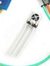

# おおかわくんとのMTG

エアコンのリモコン操作を自動化したい。
自分とこのエアコン高くないから、時刻指定ついてないから。
自分でつくろうと思いました！！！！！！！！！！

## AIスピーカー

AIスピーカで家電制御できるし、それで外付けの赤外線のやつつけたら良いんじゃね。
お手軽スピーカー。

## Arduino

リモコン、受信装置、Arduinoで自作リモコンができるぜ！

# 方法

解析は大河法でやる。
必要な機能は送信だけ。

1. リモコンの信号のデータ化
   1. ライブラリ

## リモコンキット

[リモコンキット](
https://www.amazon.co.jp/KKHMF-HX1838%E3%83%AC%E3%82%B7%E3%83%BC%E3%83%90%E3%83%A2%E3%82%B8%E3%83%A5%E3%83%BC%E3%83%AB%E3%82%AD%E3%83%83%E3%83%88-%E8%B5%A4%E5%A4%96%E7%B7%9A%E3%83%AA%E3%83%A2%E3%82%B3%E3%83%B3%E3%83%A2%E3%82%B8%E3%83%A5%E3%83%BC%E3%83%AB-Arduino%E3%81%A8%E4%BA%92%E6%8F%9B-Raspberry/dp/B07KFCCSYN/ref=sr_1_7?__mk_ja_JP=%E3%82%AB%E3%82%BF%E3%82%AB%E3%83%8A&crid=1ZKF147FVVX9N&dchild=1&keywords=%E8%B5%A4%E5%A4%96%E7%B7%9A%E3%83%AA%E3%83%A2%E3%82%B3%E3%83%B3+%E3%82%AD%E3%83%83%E3%83%8)

これを使って、Arduinoに送る。

## Arduinoで信号解析ライブラリ

[Arduino](https://www.amazon.co.jp/dp/B06Y5TBNQX/ref=cm_sw_r_tw_dp_K7DBQ3RJHM3JZYZV9S7D?_encoding=UTF8&psc=1)

## wifiとの連携したいなら、いい感じのマイコン買おう

[M5Stack](https://www.amazon.co.jp/dp/B0879JWK8F/ref=cm_sw_r_tw_dp_3BRS1M0DHT8N7CMR8K2Z)

# そもそも、そんな製品あるんじゃ？

信用できなし作ろうぜ！

# atom matrix & 送受信キットが最適

[参考記事](https://qiita.com/coppercele/items/ed91646944ca28ff0c07)

[atom matrix](https://www.switch-science.com/catalog/6260/)

[IR-UNIT](https://www.switch-science.com/catalog/5699/)

この記事をみてやればいいらしい。

## サイトの方法と公式の方法が違う

IRremoteは楽？。

<!-- 公式はUIFlow。ブロックつなげて使うやつ。
画面内なら良いや。

pythonでもうごく！？ -->

IRremoteで作成！

# 予定

商品が来るまで待機
